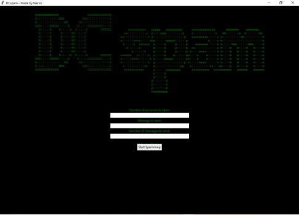

# Discord Raid Tool



A powerful, user-friendly Python tool designed for executing Discord raids without the need for token-based authentication. This tool allows you to manually log into multiple accounts, giving you greater control and flexibility in managing raids.

### Features
- **Manual Account Login**: Log in manually to multiple Discord accounts, bypassing the need for token management, ensuring better security and flexibility.
- **Intuitive Interface**: A clean, simple GUI for easy navigation and seamless operation.
- **Customizable Raids**: Configure the number of accounts and messages with customizable options for efficient raiding.
- **Rate Limiting Control**: Automatically manages sending frequency to avoid Discord rate limits and ensure smooth operation.
- **Detailed Logging**: Keep track of all actions during the raid with comprehensive logs for future reference.

### Requirements
- Python 3.x
- All dependencies listed in `requirements.txt`
- a version of Edge browser

### Installation

Download the latest executable file from the Releases tab or follow the steps below:

1. Clone the repository:
   ```bash
   git clone https://github.com/Fear2o/DCspam
   ```

2. Navigate to the project directory:
   ```bash
   cd DCspam
   ```

3. Install the required dependencies:
   ```bash
   pip install -r requirements.txt
   ```

### Usage
To use the executable version, simply run the DCspam.exe file after downloading from the Releases tab. If you're running the Python script directly:

1. Run the tool
   ```bash
   python DCspam.py
   ```

2. Follow the on-screen prompts. After entering the required information, click "Start Spamming". The tool will open multiple Edge browser windows based on the number of accounts you’ve set. After logging into the accounts, if using the .exe version, press Enter in the open command prompt. If running the Python script, follow the terminal instructions.

### Disclaimer
This tool is for educational purposes only. Unauthorized use of this tool may violate Discord's Terms of Service. Always ensure you have proper permissions before executing raids.
